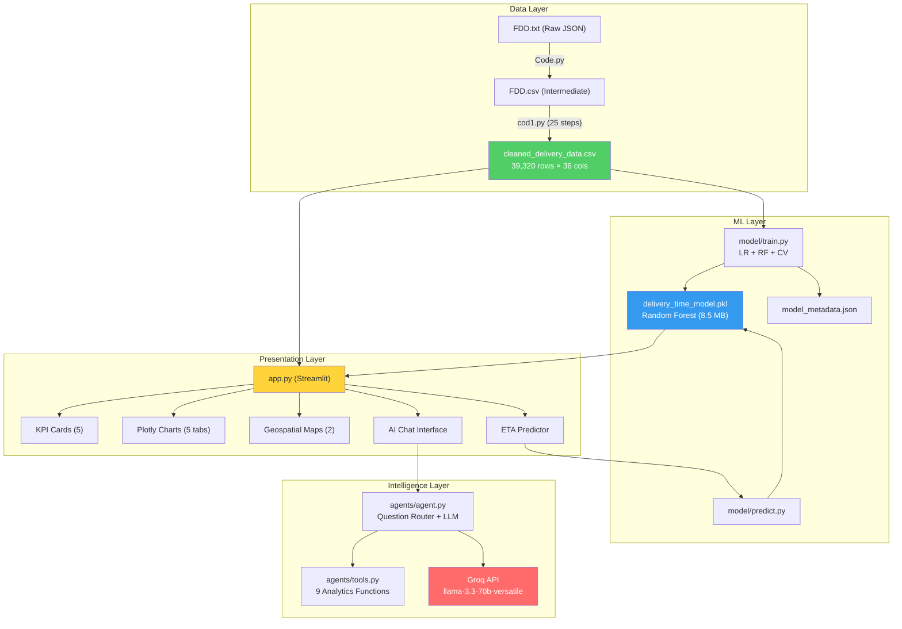

# 📋 DeliverIQ — Complete Project Documentation

> **Last Updated:** May 2026 | **Author:** Shvmgit | **Status:** Production-Ready

---

## 1. Project Overview

**DeliverIQ** is an AI-powered food delivery intelligence dashboard that analyzes ~39,000 delivery records to predict delivery times, identify operational bottlenecks, and provide LLM-powered business insights.

**Problem Statement:** Food delivery platforms struggle with accurate ETA predictions and identifying what factors cause delays. This project solves both — a trained ML model predicts ETAs with ~3 min accuracy, and an AI assistant answers natural language questions about the data.

**Target Users:** Operations managers, data analysts, and business stakeholders in food delivery companies.

---

## 2. High-Level Architecture (HLA)



### System Flow

```
User Request → Streamlit UI → Route to Component:
  ├── Dashboard View  → Pandas GroupBy → Plotly Chart
  ├── ETA Prediction  → model/predict.py → sklearn.predict()
  └── AI Question     → agent.py → tools.py (data) → Groq LLM (reasoning) → Response
```

---

## 3. Low-Level Architecture (LLA)

### 3.1 Data Pipeline Module

```
FDD.txt (JSON, 30MB)
    │
    ├── Code.py ─── JSON → DataFrame → basic cleaning → FDD.csv
    │
    └── cod1.py ─── 25-step pipeline:
         ├── Step 1-2:   Read CSV, inspect
         ├── Step 3-5:   Clean column names, strip whitespace, fill NaN
         ├── Step 6-9:   Parse datetime, compute pickup_delay, remove negatives
         ├── Step 10-13: Deduplicate, remove outliers (>120min), filter ages (18-60)
         ├── Step 14-17: Haversine distance, extract order_hour, peak_hour flag
         ├── Step 18-19: Ordinal encoding (traffic 1-4, weather 0-5)
         ├── Step 20-22: One-hot encoding (vehicle, city, order type)
         ├── Step 23-24: Derived features (is_multi_delivery, experience_score)
         └── Step 25:    Correlation analysis → save cleaned_delivery_data.csv
```

**Key transformations:**
| Raw Column | Cleaned Column | Transformation |
|-----------|---------------|----------------|
| `Time_taken(min)` | `time_takenmin` | Remove "(min)" suffix, cast to int |
| `Weatherconditions` | `weatherconditions` | Remove "conditions " prefix, lowercase |
| Lat/Lon pairs | `distance_km` | Haversine formula between restaurant & delivery |
| `Time_Orderd` / `Time_Order_picked` | `pickup_delay_min` | Datetime diff in minutes |
| `road_traffic_density` | `traffic_score` | low=1, medium=2, high=3, jam=4 |
| `weatherconditions` | `weather_score` | sunny=0 → sandstorms=5 |

### 3.2 ML Model Module

```
model/
├── __init__.py
├── train.py          # Training pipeline
│   ├── load_data()         → Load CSV, select 10 features, drop NaN
│   ├── evaluate_model()    → R², MAE, RMSE on test set
│   ├── cross_validate()    → 5-fold CV, returns mean ± std
│   └── train()             → Train LR + RF, compare, save best
│
└── predict.py        # Prediction interface
    ├── load_model()           → joblib.load() from .pkl
    ├── load_metadata()        → Read model_metadata.json
    └── predict_delivery_time() → Predict + categorize + generate insights
```

**Feature Vector (10 features):**

| # | Feature | Type | Range | Importance (RF) |
|---|---------|------|-------|-----------------|
| 1 | `delivery_person_ratings` | Float | 1.0 – 5.0 | **22.76%** |
| 2 | `weather_score` | Int | 0 – 5 | **18.25%** |
| 3 | `traffic_score` | Int | 1 – 4 | **13.74%** |
| 4 | `multiple_deliveries` | Float | 0 – 3 | **13.11%** |
| 5 | `distance_km` | Float | 0 – 50 | **11.90%** |
| 6 | `delivery_person_age` | Int | 18 – 50 | **9.68%** |
| 7 | `vehicle_condition` | Int | 0 – 2 | **7.59%** |
| 8 | `pickup_delay_min` | Float | 0 – 60 | 2.07% |
| 9 | `order_hour` | Int | 0 – 23 | 0.79% |
| 10 | `is_peak_hour` | Binary | 0, 1 | 0.11% |

### 3.3 AI Agent Module

```
agents/
├── __init__.py
├── tools.py          # 9 analytics functions
│   ├── traffic_analysis(df)       → GroupBy traffic density
│   ├── weather_analysis(df)       → GroupBy weather conditions
│   ├── vehicle_analysis(df)       → GroupBy vehicle type (mean, median, std)
│   ├── city_analysis(df)          → GroupBy city (time + distance)
│   ├── peak_hour_analysis(df)     → Peak vs non-peak comparison
│   ├── rating_analysis(df)        → GroupBy rating brackets
│   ├── distance_analysis(df)      → Quintile-based distance analysis
│   ├── festival_analysis(df)      → Festival impact
│   └── comprehensive_summary(df)  → All-in-one summary
│
└── agent.py          # LLM integration
    ├── _get_groq_client()    → st.secrets["GROQ_API_KEY"] → Groq()
    ├── _route_question()     → Keyword matching → set of route names
    ├── _get_context()        → Call relevant tools → build context dict
    ├── _call_groq()          → Groq API call with streaming support
    ├── _fallback_response()  → Template response when API unavailable
    ├── ai_agent()            → Public API: question + df → response
    └── answer_question()     → Raw data view (no LLM)
```

**Routing Logic:**
```
Question: "How does traffic affect delivery times?"
    ↓
_route_question() matches keyword "traffic" → routes = {"traffic"}
    ↓
_get_context() calls traffic_analysis(df) + general_stats(df)
    ↓
_call_groq() sends context + question to llama-3.3-70b-versatile
    ↓
Streamed response displayed in st.chat_message
```

**Keyword → Route mapping (30+ keywords):**
- traffic, congestion, road → `traffic`
- weather, rain, fog, storm, sunny → `weather`
- vehicle, motorcycle, scooter, car → `vehicle`
- city, urban, metropolitan → `city`
- peak, rush hour, busy → `peak`
- rating, rated, driver → `rating`
- distance, far, near, km → `distance`
- festival, holiday → `festival`
- (no match) → `general` (comprehensive summary)

### 3.4 Presentation Layer (app.py)

**13 sections, 686 lines:**

| Section | Lines | Component | Description |
|---------|-------|-----------|-------------|
| 1 | 19-21 | Page Config | Wide layout, expanded sidebar |
| 2 | 26-96 | Custom CSS | Gradient header, styled KPIs, chat styling |
| 3 | 101-125 | Data/Model Load | `@st.cache_data`, `@st.cache_resource` |
| 4 | 130-139 | Header | Gradient branded banner |
| 5 | 144-210 | Sidebar | Model badge + 5 multiselect filters |
| 6 | 215-250 | KPIs | 5 metric cards in columns |
| 7 | 256-350 | Charts | 5 tabbed Plotly charts |
| 8 | 356-400 | Maps | 2 scatter_mapbox (restaurant + delivery) |
| 9 | 405-485 | ETA Predictor | 10-param form → prediction + insights |
| 10 | 490-560 | Model Insights | Feature importance chart + comparison table |
| 11 | 565-577 | Business Insights | Auto-generated worst weather/city/peak stats |
| 12 | 582-664 | AI Chat | `st.chat_input` + streaming + session history |
| 13 | 669-686 | Footer | 3-column branding + tech stack + data stats |

---

## 4. Dataset Analysis

### 4.1 Dataset Characteristics

| Property | Value |
|----------|-------|
| **Original size** | 40,109 rows × 17 columns |
| **After cleaning** | 39,320 rows × 36 columns (21 original + 15 engineered) |
| **Records removed** | 789 (negative pickup delays, outliers, invalid ages) |
| **Missing values handled** | 846 in `multiple_deliveries` (filled with 0) |
| **Cities** | 3 (metropolitan, semi-urban, urban) + 1 NaN category |
| **Vehicle types** | 3 (electric_scooter, motorcycle, scooter) |
| **Weather conditions** | 6 (sunny, cloudy, windy, fog, stormy, sandstorms) |
| **Traffic levels** | 4 (low, medium, high, jam) |

### 4.2 Key Statistical Findings

**Delivery Time Breakdown:**
| Factor | Best | Worst | Delta |
|--------|------|-------|-------|
| Traffic | Low: 21.24 min | Jam: 31.15 min | +9.91 min (+47%) |
| Weather | Sunny: 21.85 min | Fog: 29.05 min | +7.20 min (+33%) |
| Vehicle | Electric scooter: 24.50 min | Motorcycle: 27.69 min | +3.19 min (+13%) |
| Peak Hour | Non-peak: 24.03 min | Peak: 28.89 min | +4.86 min (+20%) |

**Distance-ETA Correlation:** 0.325 (moderate positive)
- Closest quintile: 21.66 min avg
- Farthest quintile: 29.98 min avg

### 4.3 Feature Engineering Summary

| Feature | Formula | Purpose |
|---------|---------|---------|
| `distance_km` | Haversine(restaurant, delivery) | Physical delivery distance |
| `pickup_delay_min` | time_order_picked − time_orderd | Restaurant preparation time |
| `order_hour` | time_orderd.hour | Time-of-day pattern |
| `is_peak_hour` | 1 if hour ∈ [12-14, 19-22] | Demand surge indicator |
| `traffic_score` | low=1, medium=2, high=3, jam=4 | Ordinal traffic encoding |
| `weather_score` | sunny=0 → sandstorms=5 | Ordinal weather severity |
| `experience_score` | age × rating | Driver quality proxy |
| `is_multi_delivery` | 1 if multiple_deliveries > 0 | Batch delivery flag |

---

## 5. ML Model Deep-Dive

### 5.1 Model Comparison

| Metric | Linear Regression | Random Forest ✅ | Improvement |
|--------|-------------------|-----------------|-------------|
| **R² (test)** | 0.5149 | **0.8352** | +62.2% |
| **MAE** | 5.2524 min | **3.1107 min** | -40.8% |
| **RMSE** | 6.6048 min | **3.8500 min** | -41.7% |
| **CV R² (5-fold)** | 0.5099 ± 0.0036 | **0.8298 ± 0.0042** | +62.7% |
| **File size** | ~1 KB | 8.5 MB (compressed) | — |

### 5.2 Why Random Forest Won

1. **Non-linear interactions** — Traffic × Weather × Distance combinations that LR can't capture
2. **Feature interactions** — RF naturally models "high traffic + rain = much worse" without explicit feature crosses
3. **Robustness** — Less sensitive to outliers and multicollinearity
4. **The `is_peak_hour` anomaly** — In LR, this had a *negative* coefficient (-1.29), counterintuitively suggesting peak hours *reduce* delivery time. This was due to multicollinearity with `order_hour` and `traffic_score`. RF handles this correctly.

### 5.3 Random Forest Hyperparameters

```python
RandomForestRegressor(
    n_estimators=100,      # 100 trees
    max_depth=15,          # Prevent overfitting
    min_samples_split=10,  # Min samples to split a node
    min_samples_leaf=5,    # Min samples in a leaf
    random_state=42,       # Reproducibility
    n_jobs=-1,             # Parallel training
)
```

### 5.4 Linear Regression Coefficients (for interpretability)

| Feature | Coefficient | Interpretation |
|---------|-------------|----------------|
| `delivery_person_ratings` | **-7.34** | Each +1 rating → 7.3 min faster |
| `multiple_deliveries` | +3.66 | Each extra delivery → +3.7 min |
| `traffic_score` | +2.77 | Each traffic level up → +2.8 min |
| `vehicle_condition` | -2.45 | Better condition → 2.5 min faster |
| `is_peak_hour` | -1.29 | Anomalous (multicollinearity) |
| `delivery_person_age` | +0.40 | Each year older → +0.4 min |
| `distance_km` | +0.38 | Each km → +0.38 min |
| `weather_score` | +0.32 | Each weather level → +0.32 min |
| `order_hour` | -0.06 | Negligible |
| `pickup_delay_min` | -0.00 | Negligible |

---

## 6. Groq LLM Integration

### 6.1 Architecture

| Component | Detail |
|-----------|--------|
| **Provider** | Groq Cloud |
| **Primary model** | `llama-3.3-70b-versatile` (12K context, 100K output) |
| **Fallback model** | `meta-llama/llama-4-scout-17b-16e-instruct` (30K context) |
| **Client** | `groq` Python SDK (synchronous) |
| **Authentication** | `st.secrets["GROQ_API_KEY"]` → fallback `os.environ` |
| **Temperature** | 0.3 (low creativity, high factual accuracy) |
| **Max tokens** | 1024 |
| **Streaming** | Yes — real-time token display via `st.write_stream` |

### 6.2 Prompt Engineering

**System Prompt Role:** "DeliverIQ, an AI-powered delivery intelligence analyst"

**Key constraints:**
- Only use data provided in context — never fabricate
- 150-300 word responses
- Start with direct answer, then supporting numbers, then recommendations
- Sparse emoji usage for visual structure

**Context injection pattern:**
```
System: [analyst persona + guidelines]
User: "Question: {user_question}\n\nData Context:\n{JSON analytics data}"
```

### 6.3 Fallback Strategy

```
Try primary model (llama-3.3-70b)
    ├── Success → Stream response
    └── Fail → Try fallback model (llama-4-scout)
                  ├── Success → Return response
                  └── Fail → Template response from _fallback_response()
```

Template fallback generates responses using raw data (no LLM needed) — the app never shows an error to the user.

---

## 7. Challenges & Solutions

### 7.1 Data Challenges

| # | Challenge | Impact | Solution |
|---|-----------|--------|----------|
| 1 | Raw data in JSON inside .txt file | Couldn't load directly with pandas | Two-step: JSON parse → CSV conversion |
| 2 | 846 missing `multiple_deliveries` values | Model training would fail | Filled with 0 (assumed single delivery) |
| 3 | 789 negative pickup delays | Impossible values (pickup before order) | Removed as data entry errors |
| 4 | Inconsistent string casing ("Sunny" vs "sunny") | GroupBy would split same category | Standardized all to lowercase |
| 5 | No distance feature in raw data | Key predictor missing | Computed Haversine distance from lat/lon |
| 6 | Extreme delivery times (>120 min) | Skewed model training | Removed as outliers |
| 7 | `city` column had NaN values | Became a category "nan" | Left as-is (represents unknown city type) |

### 7.2 Model Challenges

| # | Challenge | Impact | Solution |
|---|-----------|--------|----------|
| 1 | Linear Regression R² = 0.51 | Poor predictions (±6.6 min error) | Added Random Forest → R² = 0.83 |
| 2 | `is_peak_hour` negative coefficient in LR | Counterintuitive, misleading | Multicollinearity with order_hour + traffic_score; RF handles it correctly |
| 3 | Random Forest .pkl was 32 MB | Too large for GitHub | `joblib.dump(compress=3)` → 8.5 MB |
| 4 | No cross-validation in original | Risk of overfitting to one split | Added 5-fold CV (R² = 0.8298 ± 0.004) |
| 5 | Only 10 features from 36 columns | Potential information loss | Selected features with strongest correlation to target; one-hot encodings didn't help LR |

### 7.3 Application Challenges

| # | Challenge | Impact | Solution |
|---|-----------|--------|----------|
| 1 | Fake LLM (`call_gemini_api`) | No real intelligence in assistant | Integrated Groq SDK with llama-3.3-70b |
| 2 | `st.secrets.get()` didn't work | API key not detected | Changed to `st.secrets["KEY"]` with try/except |
| 3 | Fragile question routing (needed "traffic" + "delay") | Most questions got "I don't know" | Single-keyword matching with 30+ keywords |
| 4 | 39K-point scatter plots were slow | Map rendering lag | Sampled to 1000-2000 points with `random_state` |
| 5 | Unicode emojis in print() on Windows | `UnicodeEncodeError` in terminal | `PYTHONIOENCODING=utf-8` environment variable |
| 6 | Streamlit Cloud needs secrets separately | Can't commit API keys | `.streamlit/secrets.toml` (gitignored) + st.secrets |

### 7.4 Deployment Challenges

| # | Challenge | Impact | Solution |
|---|-----------|--------|----------|
| 1 | FDD.txt was 30 MB | Bloated repo | Gitignored (not needed at runtime) |
| 2 | Missing dependencies in requirements.txt | App would crash on Cloud | Added groq, statsmodels; used >= versioning |
| 3 | Old files cluttering repo | Confusing project structure | Gitignored + deleted old scripts and PNGs |
| 4 | Git identity not configured | Commit failed | Set local git config for Shvmgit account |

---

## 8. API & Tool Reference

### 8.1 Analytics Tools (agents/tools.py)

| Function | Input | Output | Use Case |
|----------|-------|--------|----------|
| `traffic_analysis(df)` | DataFrame | `{level: {avg_time, count}}` | Traffic impact |
| `weather_analysis(df)` | DataFrame | `{condition: {avg_time, count}}` | Weather impact |
| `vehicle_analysis(df)` | DataFrame | `{type: {avg, median, std, count}}` | Vehicle comparison |
| `city_analysis(df)` | DataFrame | `{city: {avg_time, avg_distance, count}}` | City performance |
| `peak_hour_analysis(df)` | DataFrame | `{peak/non_peak: {avg_time, avg_distance}}` | Peak hour effect |
| `rating_analysis(df)` | DataFrame | `{bracket: {avg_time, count}}` | Driver rating impact |
| `distance_analysis(df)` | DataFrame | `{quintile: {avg_time, dist_range}}` | Distance buckets |
| `festival_analysis(df)` | DataFrame | `{status: {avg_time, count}}` | Festival impact |
| `general_stats(df)` | DataFrame | `{total, avg_time, avg_dist, ...}` | Overview |
| `comprehensive_summary(df)` | DataFrame | All above combined | General questions |

### 8.2 Prediction API (model/predict.py)

```python
predict_delivery_time(model, input_data) → {
    'prediction': 25.3,          # minutes
    'category': '🟡 Normal',     # 🟢<20, 🟡 20-35, 🔴>35
    'color': 'orange',
    'insights': [                 # operational notes
        "High traffic conditions are likely increasing delivery time",
        ...
    ]
}
```

---

## 9. Tech Stack

| Layer | Technology | Version | Purpose |
|-------|-----------|---------|---------|
| **Language** | Python | 3.9+ | Core |
| **Dashboard** | Streamlit | ≥1.28 | UI framework |
| **Charts** | Plotly | ≥5.17 | Interactive visualizations |
| **Maps** | Plotly + OpenStreetMap | — | Geospatial rendering |
| **ML** | Scikit-learn | ≥1.3 | Random Forest + Linear Regression |
| **Stats** | Statsmodels | ≥0.14 | OLS trendline in scatter plots |
| **Data** | Pandas | ≥2.1 | Data manipulation |
| **Numerics** | NumPy | ≥1.26 | Array operations |
| **Serialization** | Joblib | ≥1.3 | Model persistence (compressed) |
| **LLM** | Groq SDK | ≥0.4 | Chat completions API |
| **LLM Model** | Llama 3.3 70B | — | Primary reasoning model |
| **Hosting** | Streamlit Cloud | — | Free deployment |
| **VCS** | Git + GitHub | — | Version control |

---

## 10. File Structure (Final)

```
food-delivery-intelligence/          (GitHub: ShvmGit/food-delivery-intelligence)
│
├── app.py                           # Main Streamlit dashboard (686 lines)
│
├── agents/                          # AI Intelligence Layer
│   ├── __init__.py
│   ├── agent.py                     # Groq LLM integration (290 lines)
│   └── tools.py                     # 9 analytics functions (145 lines)
│
├── model/                           # ML Layer
│   ├── __init__.py
│   ├── train.py                     # Dual-model training pipeline (169 lines)
│   └── predict.py                   # Prediction + categorization (80 lines)
│
├── cleaned_delivery_data.csv        # Runtime dataset (39,320 rows, 10 MB)
├── delivery_time_model.pkl          # Trained Random Forest (8.5 MB)
├── model_metadata.json              # Model metrics + feature importances
│
├── data_cleaning_summary.txt        # 13-issue cleaning documentation
├── delivery_analysis_summary.txt    # Statistical findings
├── phase3_model_insights.txt        # LR coefficient analysis
├── PROJECT_INFO.md                  # ← This file
│
├── requirements.txt                 # 8 Python dependencies
├── README.md                        # GitHub README with badges
├── .gitignore                       # Excludes .venv, secrets, old files
└── .streamlit/
    └── secrets.toml                 # GROQ_API_KEY (gitignored)
```

---

## 11. Future Roadmap

| Priority | Enhancement | Expected Impact |
|----------|-------------|-----------------|
| 🔴 High | XGBoost model comparison | R² potentially 0.85-0.90 |
| 🔴 High | Multi-page Streamlit app | Better UX, separate analysis views |
| 🟡 Medium | Real-time data ingestion | Live dashboard updates |
| 🟡 Medium | Chat history persistence (database) | Retain conversations across sessions |
| 🟡 Medium | A/B testing framework | Compare delivery strategies |
| 🟢 Low | PDF report export | Shareable business reports |
| 🟢 Low | User authentication | Role-based access control |
| 🟢 Low | Model retraining pipeline | Scheduled auto-retraining on new data |

---

## 12. How to Reproduce

```bash
# Clone
git clone https://github.com/ShvmGit/food-delivery-intelligence.git
cd food-delivery-intelligence

# Setup
python -m venv .venv
.venv\Scripts\activate          # Windows
pip install -r requirements.txt

# Add API key
echo 'GROQ_API_KEY = "your-key"' > .streamlit/secrets.toml

# Retrain model (optional)
python -m model.train

# Run
streamlit run app.py
```
